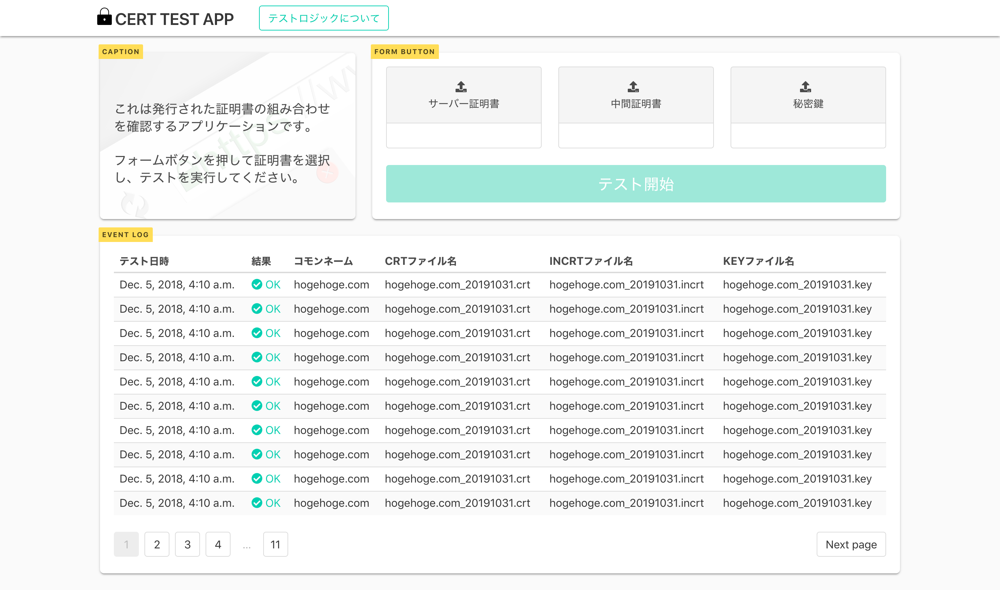

# CERT-TEST-APP

これはSSL/TLS証明書の組み合わせをチェックするアプリケーションです。

`OpenSSL`を使ってサーバー証明書と中間証明書、秘密鍵の組み合わせをチェックします。

2018年10月~11月ごろ、djangoの勉強を兼ねて、お世話になっていた現場の運用フロー改善のために作りました。

コードをみていただくと分かりますが、色々と斬新すぎて見直すべき点が多いです。



次のようなフローで動作します。
1. 証明書ファイルの選択→STARTボタンを押下
2. サーバ証明書のsubjectと中間証明書のissuer（組み合わせが正しいか）がチェックされる
3. 正常な組み合わせだった場合はコモンネームを取得し、裏でNginxのコンフィグを書き換えてコンテナが起動
4. 目視でチェックしたい場合はNginxへのhostsを追記することで、ブラウザから確認することができます。

## テストロジックについて

1. サーバー証明書と中間証明書のチェック  
サーバー証明書のsubjectと中間証明書のissuerが一致すればOK、一致しなければNGとなります。
```
openssl x509 -subject_hash -noout -in INCRT.crt
openssl x509 -issuer_hash -noout -in CRT.crt
```

2. サーバー証明書と秘密鍵のチェック  
サーバー証明書に含まれている公開鍵と、CSR作成に使用した秘密鍵が一致すればOK、一致しなければNGとなります。
```
openssl rsa -noout -modulus -in KEY.key | openssl md5
openssl x509 -noout -modulus -in CRT.crt | openssl md5
```

# 仕様

`docker`と`docker-compose`が必要です。

# 使い方

## 1. git clone

まずこのリポジトリを`git clone`します。

## 2. 初期設定

クローンしたリポジトリに移動し、次のコマンドを実行します。

```
docker-compose up -d
```

環境によっては、__settings.py__の`ALLOWED_HOSTS`を書き換える必要があるかもしれません。

```
# 現在の設定
ALLOWED_HOSTS = ['localhost', '192.168.33.11', '[::1]']
```

## 3. ブラウザへアクセス

設定が完了したら、ブラウザからローカルホストのポート8000へアクセスするだけでOKです。

```
例:  
http://localhost:8000  
http://192.168.33.11:8000
```

## 4. クリーンアップ

#### # Stop & delete (container, network)

```
docker-compose down
```

#### Stop & delete (container, network, image)

```
docker-compose down --rmi all
```

#### Stop & delete (container, network, volume)

```
docker-compose down -v
```

以上です。
